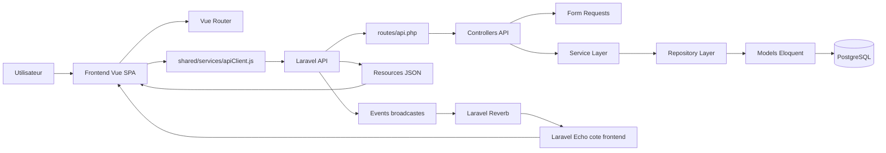

# Architecture EasyClubSport

## 1. Vue d'ensemble

EasyClubSport est une application web decoupee en deux grands blocs :

- un backend API Laravel dans `backend/`
- un frontend SPA Vue.js dans `frontend/`

Le tout est lance via Docker avec plusieurs services :

- `db` : PostgreSQL
- `backend` : API Laravel
- `queue` : worker Laravel pour la file d'attente
- `reverb` : serveur WebSocket Laravel Reverb
- `frontend` : serveur de developpement Vite pour la SPA Vue

Le projet suit globalement cette logique :

```text
Utilisateur
  -> Frontend Vue.js
  -> API Laravel
  -> Services metier
  -> Repositories
  -> Modeles Eloquent
  -> PostgreSQL
```

Pour le temps reel :

```text
Frontend Vue.js
  -> Laravel Echo + Reverb
  -> Channels prives Laravel
  -> Events broadcastes par le backend
```

## 2. Technologies verifiees dans le projet

### Backend

- PHP 8.2
- Laravel 12
- Laravel Sanctum
- Laravel Reverb
- PostgreSQL
- architecture API REST

### Frontend

- Vue 3
- Vue Router
- Vite
- Tailwind CSS 4
- Laravel Echo
- Pusher JS utilise comme client transport de Reverb

### DevOps / execution

- Docker Compose
- images `php:8.2-cli`, `node:20-alpine`, `postgres:16-alpine`

## 3. Patterns d'architecture identifies

Le code du backend montre clairement ces patterns :

### MVC Laravel

- `routes/api.php` expose les endpoints
- les controllers recoivent la requete
- les modeles Eloquent representent les tables

### Form Request

La validation est separee dans `app/Http/Requests`.

Exemple :

- `Auth/ConnexionRequest.php`
- `President/Messagerie/CreerCanalRequest.php`

### Service Layer

La logique metier est deplacee dans `app/Services`.

Exemple :

- `AuthService`
- `President\Messagerie\MessagerieService`
- `Coach\Dashboard\DashboardCoachService`

### Repository Pattern

L'acces aux donnees est centralise dans `app/Repositories`.

Exemple :

- `AuthRepository`
- `President\Messagerie\MessagerieRepository`
- `Coach\Dashboard\DashboardCoachRepository`

### Resource / ResourceCollection

Les reponses JSON sont normalisees dans `app/Http/Resources`.

Exemple :

- `AuthResource`
- `President\Messagerie\MessageResource`
- `President\Messagerie\MessageCollection`

### Policies + Middleware de role

La securite combine deux couches :

- `auth:sanctum` pour verifier le token
- `role:president|coach|joueur` pour segmenter les espaces

En plus, certaines actions sont verifiees finement par policy :

- `CanalPolicy`
- `MessagePolicy`
- `ClubPolicy`
- `EvenementPolicy`

## 4. Schema global



## 5. Organisation par grands blocs

### `backend/`

Contient l'API Laravel, la logique metier, la securite, les modeles, les migrations, les evenements temps reel et les scripts Docker backend.

### `frontend/`

Contient la SPA Vue.js, les pages de connexion et d'inscription, les espaces par role, les services HTTP et realtime, ainsi que les composants partages.

### `docs/`

Contient la documentation du projet. Ce dossier inclut deja des presentations HTML/PDF et accueille maintenant la documentation d'architecture.

### `diagrammes/`

Contient des diagrammes d'analyse et de conception visuelle.

### `docker-compose.yml`

Decrit comment lancer tous les services du projet et comment ils communiquent.

## 6. Services reels presents dans Docker

Le fichier `docker-compose.yml` confirme les services suivants :

| Service | Role |
|---|---|
| `db` | Base PostgreSQL principale |
| `backend` | API Laravel accessible sur `http://localhost:8000` |
| `queue` | Worker Laravel pour la file d'attente |
| `reverb` | Serveur WebSocket accessible sur le port `8081` |
| `frontend` | Application Vue via Vite sur `http://localhost:5173` |

## 7. Ce qui est configure mais non present dans Docker

Le projet contient aussi quelques configurations Laravel qui ne sont pas actives dans le `docker-compose.yml` actuel :

- Redis est present dans `config/database.php` et `config/reverb.php`, mais aucun service Redis n'est lance
- le stockage est sur disque local via `FILESYSTEM_DISK=local`, pas sur S3 ou MinIO
- le mailer est en mode `log`, donc les emails sont ecrits dans les logs plutot qu'envoyes a un vrai serveur SMTP

## 8. Points d'entree reels du projet

### Backend

- bootstrap principal : `backend/bootstrap/app.php`
- routes API : `backend/routes/api.php`
- point d'acces HTTP public : `backend/public/index.php`

### Frontend

- entree principale : `frontend/src/main.js`
- composant racine : `frontend/src/App.vue`
- configuration des pages : `frontend/src/router/index.js`

## 9. Conclusion

L'architecture reelle du projet est proprement separee :

- Vue gere l'interface et l'experience utilisateur
- Laravel gere l'API, la securite et la logique metier
- PostgreSQL stocke les donnees
- Reverb diffuse les evenements temps reel
- Docker assemble l'ensemble en environnement coherent

Le projet suit une approche pedagogique et maintenable :

- controllers relativement fins
- services metier explicites
- repositories dedies aux acces base de donnees
- ressources JSON standardisees
- separation par role cote backend et frontend
