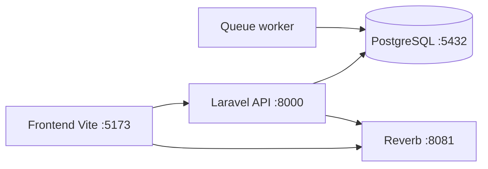

# Architecture Docker

## 1. Role de Docker dans ce projet

Docker sert a lancer tous les services du projet dans un environnement coherent, sans devoir installer manuellement chaque composant sur la machine.

Le fichier principal est :

- `docker-compose.yml`

## 2. Services reels definis



## 3. Detail des services

### `db`

- image : `postgres:16-alpine`
- conteneur : `easyclubsport-db`
- port expose : `5432`
- base : `easyclubsport`

Role :

- stocker les donnees principales du projet

### `backend`

- construit depuis `backend/Dockerfile`
- conteneur : `easyclubsport-backend`
- port expose : `8000`

Role :

- exposer l'API Laravel
- servir les routes API
- executer les migrations au demarrage

Commande de lancement :

- `sh /app/docker/start.sh web`

### `queue`

- meme image que le backend
- conteneur : `easyclubsport-queue`

Role :

- lancer `php artisan queue:listen`

Important :

- la queue utilise actuellement `QUEUE_CONNECTION=database`
- cela signifie que les jobs sont stockes en base PostgreSQL, pas dans Redis

### `reverb`

- meme image que le backend
- conteneur : `easyclubsport-reverb`
- port expose : `8081`

Role :

- lancer le serveur WebSocket Laravel Reverb

Commande :

- `php artisan reverb:start`

### `frontend`

- construit depuis `frontend/Dockerfile`
- conteneur : `easyclubsport-frontend`
- port expose : `5173`

Role :

- lancer Vite en mode developpement
- servir la SPA Vue

## 4. Comment les conteneurs communiquent

### Frontend vers backend

Le frontend utilise :

- `VITE_API_BASE_URL=http://localhost:8000/api`

Depuis le navigateur, les requetes vont donc vers :

- `http://localhost:8000/api/...`

### Frontend vers Reverb

Le frontend utilise :

- `VITE_REVERB_HOST=localhost`
- `VITE_REVERB_PORT=8081`

Depuis le navigateur, Echo se connecte donc au WebSocket expose par le service `reverb`.

### Backend vers base de donnees

Dans `backend/.env.docker` :

- `DB_HOST=db`
- `DB_PORT=5432`

Le service `backend` ne parle pas a `127.0.0.1`, il parle au conteneur Docker nomme `db`.

### Queue vers base

Le service `queue` utilise aussi :

- `DB_HOST=db`

Il lit et traite les jobs stockes dans la base.

### Backend vers Reverb

Dans `backend/.env.docker` :

- `BROADCAST_CONNECTION=reverb`
- `REVERB_HOST=localhost`
- `REVERB_PORT=8081`

Laravel diffuse donc ses events via Reverb.

## 5. Variables d'environnement importantes

### Backend Docker

Fichier :

- `backend/.env.docker`

Valeurs importantes :

- `DB_CONNECTION=pgsql`
- `DB_HOST=db`
- `DB_DATABASE=easyclubsport`
- `BROADCAST_CONNECTION=reverb`
- `QUEUE_CONNECTION=database`
- `REVERB_PORT=8081`

### Frontend Docker

Fichier :

- `frontend/.env.docker`

Valeurs importantes :

- `VITE_API_BASE_URL=http://localhost:8000/api`
- `VITE_REVERB_HOST=localhost`
- `VITE_REVERB_PORT=8081`

## 6. Particularite importante du projet

Le backend monte le dossier local `./backend` dans `/app`.

Pour eviter que Laravel charge accidentellement le mauvais `.env`, le projet passe explicitement :

- `APP_ENV_FILE=.env.docker`

Cette logique est prise en charge dans :

- `backend/bootstrap/app.php`

Et les services backend/queue/reverb declarent cette variable dans `docker-compose.yml`.

## 7. Scripts de demarrage

### `backend/docker/start.sh`

Ce script :

1. attend que PostgreSQL soit disponible
2. installe Composer si besoin
3. cree les dossiers de logs/cache
4. lance `storage:link`
5. lance `migrate --force`
6. demarre :
   - le serveur web
   - ou le worker queue
   - ou Reverb

### `frontend/docker/start.sh`

Ce script :

1. installe les dependances npm si besoin
2. lance `npm run dev -- --host 0.0.0.0 --port 5173`

## 8. Commandes Docker utiles

### Demarrer le projet

```bash
docker compose up -d
```

### Voir les logs

```bash
docker compose logs -f
```

### Voir les logs d'un service

```bash
docker compose logs -f backend
docker compose logs -f frontend
docker compose logs -f reverb
docker compose logs -f queue
```

### Arreter le projet

```bash
docker compose down
```

### Rebuild complet

```bash
docker compose up -d --build
```

### Recreer un service

```bash
docker compose up -d --force-recreate backend
```

### Entrer dans un conteneur

```bash
docker exec -it easyclubsport-backend sh
docker exec -it easyclubsport-frontend sh
```

## 9. Ce qui n'est pas present dans Docker actuellement

En se basant sur les vrais fichiers :

- pas de service Redis dans `docker-compose.yml`
- pas de Nginx reverse proxy
- pas de MinIO
- pas de service SMTP dedie

Donc l'architecture actuelle est plus simple que certains schemas generiques :

- PostgreSQL
- Laravel API
- Laravel Queue
- Laravel Reverb
- Vue/Vite

## 10. Resume simple

Docker permet ici de lancer tout le projet avec une seule commande.

Chaque service a un role clair :

- `frontend` affiche l'application
- `backend` sert l'API
- `db` stocke les donnees
- `queue` traite les taches asynchrones
- `reverb` gere le temps reel
