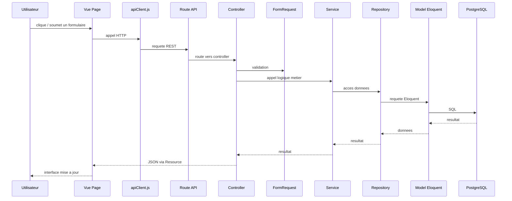

# Cycle Complet D'une Requete

## 1. Idee generale

Dans EasyClubSport, une action utilisateur suit presque toujours le meme parcours :

1. l'utilisateur agit dans une page Vue
2. le frontend appelle l'API Laravel
3. Laravel valide la requete
4. le controller appelle un service
5. le service appelle un repository
6. le repository lit ou ecrit dans PostgreSQL via Eloquent
7. le resultat remonte
8. Laravel renvoie du JSON
9. Vue met a jour l'interface

## 2. Schema simple

## 3. Exemple reel : connexion utilisateur

### Cote frontend

Fichier :

- `frontend/src/features/auth/views/LoginPage.vue`

Fonctionnement :

1. l'utilisateur remplit `email` et `password`
2. la page appelle `post('/auth/connexion', formulaire)`
3. cet appel passe par `frontend/src/shared/services/apiClient.js`

### Cote backend

Route :

- `POST /api/auth/connexion`

Elle est definie dans :

- `backend/routes/api.php`

Puis :

1. la route appelle `AuthController@connexion`
2. `ConnexionRequest` valide `email` et `password`
3. `AuthController` appelle `AuthService->connecter(...)`
4. `AuthService` utilise `AuthRepository->trouverParEmail(...)`
5. le repository charge `User` depuis PostgreSQL
6. `AuthService` verifie le mot de passe avec `Hash::check`
7. si tout est correct, `AuthRepository->creerToken(...)` cree un token Sanctum
8. `AuthResource` construit la reponse JSON

### Retour vers le frontend

La page `LoginPage.vue` recupere :

- `data.token`
- `data.utilisateur`

Puis elle :

- sauvegarde le token dans `localStorage`
- sauvegarde l'utilisateur dans `localStorage`
- redirige selon le role :
  - `president` -> `/president`
  - `coach` -> `/coach`
  - `joueur` -> `/joueur`

## 4. Exemple reel : chargement d'un dashboard coach

### Cote frontend

Fichier :

- `frontend/src/roles/coach/dashboard/views/CoachDashboardPage.vue`

Au montage :

1. la page appelle `authGet('/coach/dashboard')`
2. elle appelle aussi `authGet('/auth/moi')`
3. `apiClient.js` ajoute automatiquement le header `Authorization: Bearer <token>`

### Cote backend

Route :

- `GET /api/coach/dashboard`

Protection :

- `auth:sanctum`
- `role:coach`

Flux :

1. la route appelle `DashboardCoachController@index`
2. le controller appelle `DashboardCoachService->recupererDashboard(user)`
3. le service appelle `DashboardCoachRepository`
4. le repository interroge :
   - `Equipe`
   - `Evenement`
   - `Convocation`
   - `Canal`
5. le service regroupe les donnees
6. le controller renvoie un JSON

### Retour vers le frontend

La vue met a jour :

- les cartes statistiques
- l'equipe active
- les evenements
- les canaux recents

## 5. Exemple reel : envoi d'un message dans la messagerie

### Cote frontend

Dans les modules de messagerie coach, joueur ou president :

1. l'utilisateur tape un message
2. la vue appelle `authPost('/.../canaux/{id}/messages', { contenu })`

### Cote backend

Exemple president :

- route `POST /api/president/canaux/{canal}/messages`
- controller `MessagerieController@storeMessage`
- service `MessagerieService->envoyerMessage(...)`
- repository `MessagerieRepository->creerMessage(...)`

Le repository :

1. cree un `Message`
2. charge les relations utiles
3. declenche `event(new MessageEquipeEnvoye($message))`

En parallele, le service appelle aussi :

- `NotificationService->notifierNouveauMessage($message)`

### Retour classique HTTP

Le controller renvoie un `MessageResource` avec le message cree.

### Retour temps reel

L'event `MessageEquipeEnvoye` broadcast sur :

- `private-canal.{canalId}.messages`

Plus precisement dans le code Laravel :

- `PrivateChannel("canal.{$message->canal_id}.messages")`

Le frontend, deja abonne via Echo, recoit l'event `.message.envoye` et ajoute le message a l'ecran sans recharger toute la page.

## 6. Role de `apiClient.js`

`frontend/src/shared/services/apiClient.js` centralise les appels HTTP.

Il fait plusieurs choses importantes :

- construit l'URL API a partir de `VITE_API_BASE_URL`
- envoie les donnees JSON ou `FormData`
- ajoute le token Bearer si `authentifier: true`
- lit les reponses JSON
- affiche un toast si l'API renvoie une erreur

Cela evite de reecrire la meme logique dans toutes les pages.

## 7. Role des Resources Laravel

Les controllers renvoient souvent des `Resource` ou `Collection`.

Exemple :

- `AuthResource`
- `MessageResource`
- `MessageCollection`

Leur utilite :

- garder une structure de JSON stable
- filtrer les champs exposes
- uniformiser la forme des reponses

## 8. Role des FormRequest

Les `FormRequest` servent a valider les donnees avant d'entrer dans la logique metier.

Exemple :

- `ConnexionRequest`
- `InscriptionRequest`
- `CreerCanalRequest`

Cela permet :

- des controllers plus simples
- des erreurs de validation propres
- une logique reutilisable

## 9. Resume en mots simples

Le frontend ne parle jamais directement a la base de donnees.

Il parle a Laravel.

Laravel :

- verifie l'utilisateur
- valide la requete
- applique les regles metier
- lit ou modifie la base
- renvoie du JSON propre

Ensuite Vue :

- affiche les donnees
- met a jour les listes
- redirige l'utilisateur
- ecoute les mises a jour temps reel si besoin
